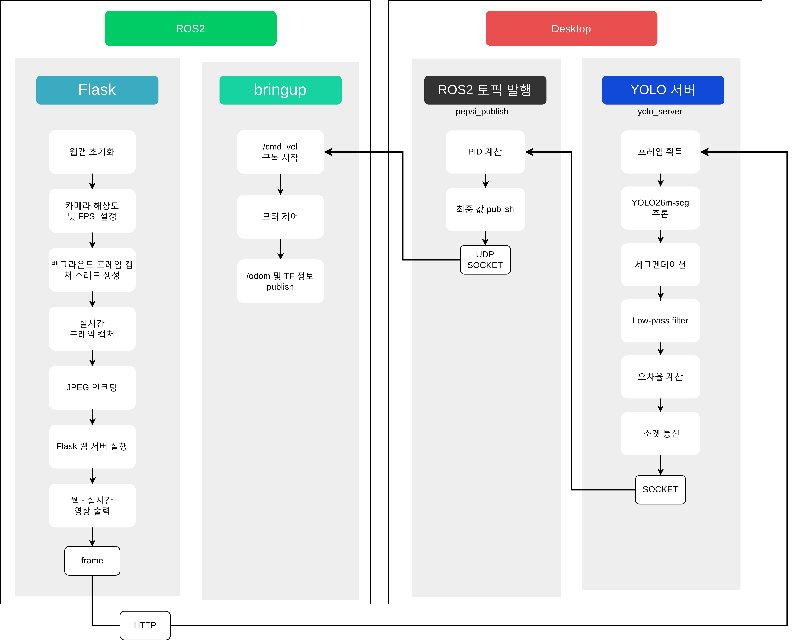
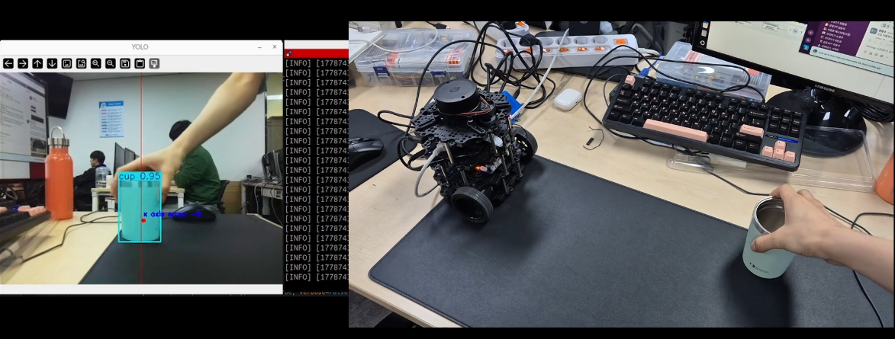

# ROS2_yolo_pid_tracking


## 프로젝트 설명

이 프로젝트는 ROS2와 TurtleBot3를 활용하여 객체 추적 시스템을 구현한 미니 프로젝트입니다. TurtleBot3에서 Flask를 이용한 웹캠 스트리밍 서버를 실행하고, PC에서 해당 웹 페이지에 접속하여 YOLO를 통해 객체를 탐지합니다. 탐지된 객체의 위치를 분석하여 중간 지점과의 거리를 계산하고, PID 제어를 통해 TurtleBot3에 회전 명령을 내립니다. TurtleBot3은 bringup을 통해 /cmd_vel 토픽을 구독하여 회전 동작을 수행합니다.


## 주요 기능

- **웹캠 스트리밍**: TurtleBot3에서 Flask 서버를 통해 실시간 웹캠 스트리밍
- **객체 탐지**: PC에서 YOLO를 이용한 실시간 객체 탐지
- **위치 계산**: 탐지된 객체의 중심 위치를 계산하여 화면 중간과의 거리 측정
- **PID 제어**: 계산된 거리에 따라 TurtleBot3의 회전 속도를 PID 제어로 조정
- **ROS2 통신**: /cmd_vel 토픽을 통해 TurtleBot3 제어


## 구성도 및 흐름


## 시연 영상


https://youtu.be/_1meOx0wfD8


## 파일 구조

```
ROS2_yolo_pid_tracking/
├── LICENSE
├── README.md
├── PC_client/
│   ├── pepsi_publish.py      # ROS2 퍼블리셔: PID 제어로 /cmd_vel 퍼블리시
│   └── yolo_calc_center.ipynb # YOLO 객체 탐지 및 중심 계산 Jupyter 노트북
└── ROS2_server/
    ├── rpicam_stream_server.py  # 라즈베리파이 카메라 스트리밍 서버
    ├── webcam_stream_server.py  # 웹캠 스트리밍 서버
    └── templates/
        └── index.html            # 웹 페이지 템플릿
```


## 요구사항

- ROS2 (jazzy)
- TurtleBot3 패키지
- Python 3.8+
- Flask
- OpenCV
- Ultralytics YOLO
- Jupyter Notebook


## 사용 방법

1. **TurtleBot3에서 스트리밍 서버 실행**:
   TurtleBot3에 ROS2_server 디렉토리 복사
   ```bash
   # ROS2_server 디렉토리로 이동
   cd ROS2_server

   # 웹캠 스트리밍 서버 실행 (웹캠 사용 시)
   python3 webcam_stream_server.py
   # 또는
   # Picam 스트리밍 서버 실행 (Picam 사용 시)
   python3 rpicam_stream_server.py
   ```

2. **TurtleBot3 bringup**:
   ```bash
   # 새로운 터미널에서
   export TURTLEBOT3_MODEL=burger
   ros2 launch turtlebot3_bringup robot.launch.py
   ```

3. **PC에서 객체 탐지 실행**:
   - `PC_client/yolo_calc_center.ipynb`를 Jupyter에서 열어 실행
   - 새로운 터미널에서 `pepsi_publish.py`를 직접 실행하여 ROS2 노드로 /cmd_vel 퍼블리시
   ```bash
   # 새로운 터미널에서
   # `pepsi_publish.py`를 직접 실행하여 ROS2 노드로 /cmd_vel 퍼블리시
   python3 pepsi_publish.py
   ```


## PID 제어 설명

- 객체의 중심 x좌표와 화면 중간의 차이를 오차로 계산
- PID 알고리즘으로 회전 속도 계산
- /cmd_vel 토픽에 angular.z 값으로 퍼블리시

## 트러블슈팅

### Case1) rpicam-apps 빌드 오류: libavcodec API version is too old

**환경:** Ubuntu 24.04

**오류 메시지:**
error: #error "Error: libavcodec API version is too old for the libav encoder!"

**원인:**
Ubuntu 24.04 기본 패키지의 libavcodec 버전이
rpicam-apps 1.12.0 요구 버전보다 낮음

**해결:**
`-Denable_libav=disabled` 옵션으로 빌드
```bash
meson setup build \
  -Denable_libav=disabled \
  -Denable_drm=enabled \
  ...
```
