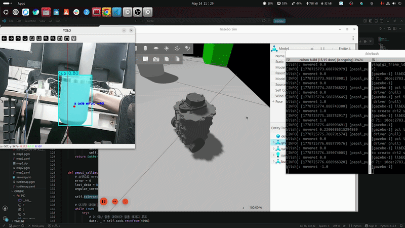
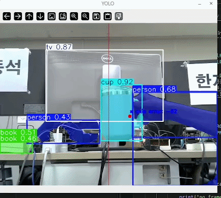
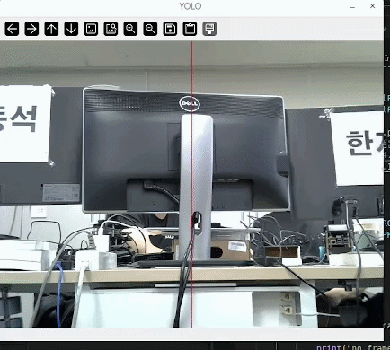
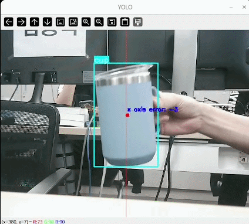
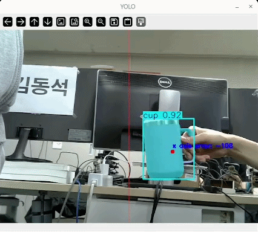

# ROS2_yolo_pid_tracking


## 프로젝트 설명

이 프로젝트는 ROS2와 TurtleBot3를 활용하여 객체 추적 시스템을 구현한 미니 프로젝트입니다. TurtleBot3에서 Flask를 이용한 웹캠 스트리밍 서버를 실행하고, PC에서 해당 웹 페이지에 접속하여 YOLO를 통해 객체를 탐지합니다. 탐지된 객체의 위치를 분석하여 중간 지점과의 거리를 계산하고, PID 제어를 통해 TurtleBot3에 회전 명령을 내립니다. TurtleBot3은 bringup을 통해 /cmd_vel 토픽을 구독하여 회전 동작을 수행합니다.


## 주요 기능

- **웹캠 스트리밍**: TurtleBot3에서 Flask 서버를 통해 실시간 웹캠 스트리밍
- **객체 탐지**: PC에서 YOLO를 이용한 실시간 객체 탐지
- **위치 계산**: 탐지된 객체의 중심 위치를 계산하여 화면 중간과의 거리 측정
- **PID 제어**: 계산된 거리에 따라 TurtleBot3의 회전 속도를 PID 제어로 조정
- **ROS2 통신**: /cmd_vel 토픽을 통해 TurtleBot3 제어


## 구성도 및 흐름


## 시연 영상

[](https://youtu.be/_1meOx0wfD8)

[유튜브](https://youtu.be/_1meOx0wfD8)


가상 환경에서 테스트

## 파일 구조

```
ROS2_yolo_pid_tracking/
├── LICENSE
├── README.md
├── PC_client/
│   ├── pepsi_publish.py      # ROS2 퍼블리셔: PID 제어로 /cmd_vel 퍼블리시
│   └── yolo_calc_center.ipynb # YOLO 객체 탐지 및 중심 계산 Jupyter 노트북
└── ROS2_server/
    ├── rpicam_stream_server.py  # 라즈베리파이 카메라 스트리밍 서버
    ├── webcam_stream_server.py  # 웹캠 스트리밍 서버
    └── templates/
        └── index.html            # 웹 페이지 템플릿
```


## 요구사항

- ROS2 (jazzy)
- TurtleBot3 패키지
- Python 3.8+
- Flask
- OpenCV
- Ultralytics YOLO
- Jupyter Notebook


## 사용 방법

1. **TurtleBot3에서 스트리밍 서버 실행**:
   TurtleBot3에 ROS2_server 디렉토리 복사
   ```bash
   # ROS2_server 디렉토리로 이동
   cd ROS2_server

   # 웹캠 스트리밍 서버 실행 (웹캠 사용 시)
   python3 webcam_stream_server.py
   # 또는
   # Picam 스트리밍 서버 실행 (Picam 사용 시)
   python3 rpicam_stream_server.py
   ```

2. **TurtleBot3 bringup**:
   ```bash
   # 새로운 터미널에서
   export TURTLEBOT3_MODEL=burger
   ros2 launch turtlebot3_bringup robot.launch.py
   ```

3. **PC에서 객체 탐지 실행**:
   - `PC_client/yolo_calc_center.ipynb`를 Jupyter에서 열어 실행
   - 새로운 터미널에서 `pepsi_publish.py`를 직접 실행하여 ROS2 노드로 /cmd_vel 퍼블리시
   ```bash
   # 새로운 터미널에서
   # `pepsi_publish.py`를 직접 실행하여 ROS2 노드로 /cmd_vel 퍼블리시
   python3 pepsi_publish.py
   ```


## PID 제어 설명

- 객체의 중심 x좌표와 화면 중간의 차이를 오차로 계산
- PID 알고리즘으로 회전 속도 계산
- /cmd_vel 토픽에 angular.z 값으로 퍼블리시

## 트러블슈팅

### Case1) rpicam-apps 빌드 오류: libavcodec API version is too old

**환경:** Ubuntu 24.04

**오류 메시지:**
error: #error "Error: libavcodec API version is too old for the libav encoder!"

**원인:**
Ubuntu 24.04 기본 패키지의 libavcodec 버전이
rpicam-apps 1.12.0 요구 버전보다 낮음

**해결:**
`-Denable_libav=disabled` 옵션으로 빌드
```bash
meson setup build \
  -Denable_libav=disabled \
  -Denable_drm=enabled \
  ...
```

### Case2) YOLO 환경(conda)과 ROS2 환경(venv) 분리 문제

**문제**  
YOLO 추론은 `conda` 가상환경에서, ROS2는 `venv` 가상환경에서 동작하도록 구성되어 있어 두 환경을 단일 프로세스로 통합하려 했으나, 패키지 버전 충돌로 인해 불가능했다.

**해결 방법 탐색**

| 방법 | 검토 내용 | 결과 |
|------|-----------|------|
| **SQLite** | 파일 기반 DB로 데이터 공유 가능 | ❌ 단순 좌표 전달에 DB는 과하다 |
| **Redis** | 이전 프로젝트 경험 있음에서 사용, 메모리 방식으로 속도 향상됨 | ❌ 별도 서버 구동 필요, 여전히 무거다 |
| **MQTT** | 이전 프로젝트 경험 있음 | ❌ 구현 복잡힘, 브로커 필요함 |
| **Socket** | MQTT 내부도 소켓 기반임을 확인 | 🔵 가볍고, 구현 단순하다 |

> MQTT가 내부적으로 소켓 통신을 사용한다는 점에서,  
> 브로커 없이 소켓만으로 직접 구현하면 충분하다고 판단.
> 

**해결**  
두 환경을 별도 프로세스로 분리하고, **소켓(Socket) 통신**으로 데이터를 주고받는 구조를 채택함.  
YOLO 추론 결과(객체 중심 좌표)를 소켓으로 전송 → ROS2 노드에서 수신 후 `cmd_vel` 퍼블리시

```python
# 데이터를 JSON으로 직렬화해서 socket 전송
data = json.dumps(error).encode('utf-8')
sock.sendto(data, server_address)

# 마지막 데이터만 읽음. 더 이상 읽을 데이터가 없을 때까지 루프
while True:
   try:
      # 소켓으로 오차 받아 온 후 pid제어하기
      data, _ = self.sock.recvfrom(4096)
      last_data = data 
   except BlockingIOError:
      # 버퍼가 비었을 때 루프 탈출
      break
```

전체 구조

```
[YOLO 프로세스 - conda]  →(socket)→  [ROS2 노드 - venv]  →  TurtleBot
```


### Case3) 한 프레임에서 여러 객체가 동시에 감지되는 문제

**문제**  
기존 코드는 프레임 내 모든 객체를 탐지하도록 구성되어 있어, 컵 외의 객체까지 함께 감지되었다.



**원인**  
`model.predict()`에 클래스 필터링 옵션이 없어 COCO 기준 전체 클래스를 추론이 되었다.

**해결**  
`classes` 파라미터로 추론 대상 클래스를 컵(class ID: 41)으로 한정하였다.



```python
# Before
results = model.predict(frame, stream=true, device=0, conf=0.7)

# After
results = model.predict(frame, classes=[41], stream=true, device=0, conf=0.7)
```

---

### Case4) 객체 중심점 떨림(Jitter) 문제

**문제**  
Segmentation 결과의 마스크 넓이 기준으로 산출한 중심점에 원형 마커를 표시했는데, 마커가 심하게 떨리는 현상이 발생하였다.



**원인**  
프레임마다 고속으로 Segmentation을 수행하면서 마스크 경계가 픽셀 단위로 미세하게 변동되고, 이 작은 변동이 중심 좌표의 급격한 흔들림으로 이어졌다.

**해결**  
**로우패스 필터(Low-pass Filter)** 를 적용해 이전 프레임의 좌표값과 가중 평균을 내어 중심점을 부드럽게 보정하였다.




